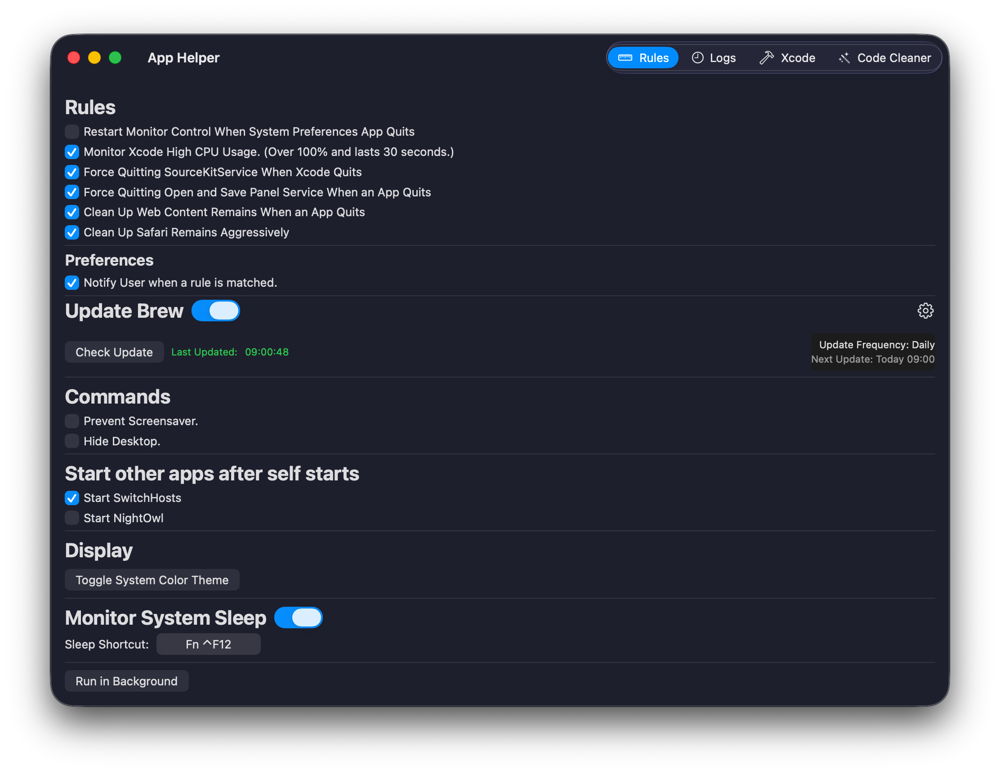

# App Helper
> This app is not sandboxed. As it can terminated other apps and services.

## How to Use
1. Enabled the rules you want to apply.
2. Click "Run in Background".

That's all. 

## Suggestions
If you have other rules you want to apply, please file them on Github issues.

## Images
<a href="https://www.flaticon.com/free-icons/lion" title="lion icons">Lion icons created by justicon - Flaticon</a>
<a href="https://www.flaticon.com/free-icons/lion" title="lion icons">Lion icons created by Freepik - Flaticon</a>
