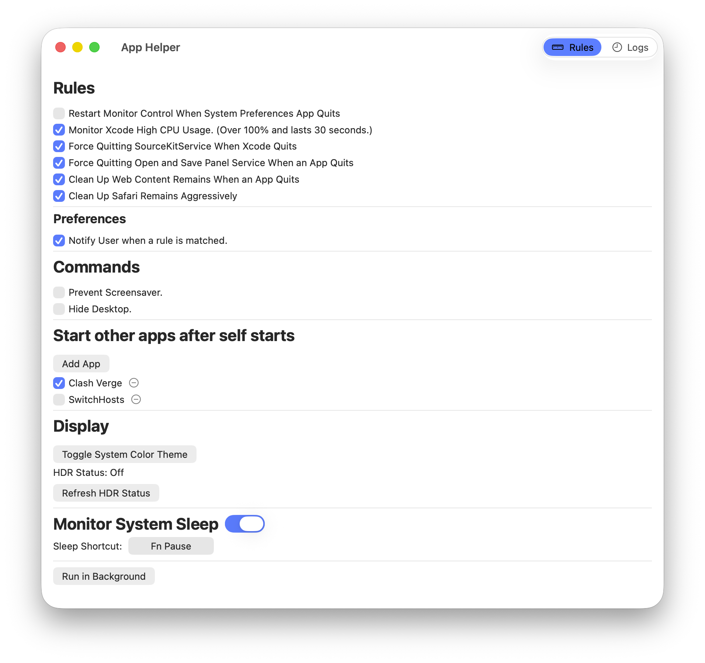

# App Helper
> This app is not sandboxed. As it can terminated other apps and services.

Project website: https://owenzhao.github.io/App-Helper/


<picture>
  <source media="(prefers-color-scheme: dark)" srcset="website/public/images/app-helper-rules-dark.png">
  
</picture>


## How to Use
1. Enabled the rules you want to apply.
2. Click "Run in Background".

That's all. 

## Updates

The direct-download macOS build checks for updates automatically. Users can also
choose **Check for Updates…** from the menu bar icon.

Updates are published through the [Sparkle](https://sparkle-project.org/) appcast
at `https://owenzhao.github.io/App-Helper/appcast.xml`. The app only accepts
updates signed with App Helper's EdDSA key, in addition to normal macOS code
signing validation.

To publish a new direct-download build:

1. Archive, Developer ID sign, and notarize the release build. Increase
   `CURRENT_PROJECT_VERSION` for every update.
2. Create a `.dmg` or `.zip` containing only `App Helper.app`, then use
   Sparkle's `generate_appcast` tool to sign the archive and update
   `website/public/appcast.xml`. Keep the archive filenames in a local release
   directory so Sparkle can retain prior update entries and generate deltas:

   ```sh
   generate_appcast \
     --account com.parussoft.app-helper.sparkle \
     --download-url-prefix "https://github.com/owenzhao/App-Helper/releases/download/vX.Y.Z/" \
     --link "https://owenzhao.github.io/App-Helper/" \
     /path/to/app-helper-release-archives
   ```

   Copy the generated `appcast.xml` to `website/public/appcast.xml`.
3. Upload the signed archive to the matching GitHub Release and commit the
   generated `appcast.xml`. The existing GitHub Pages workflow publishes the
   feed.

The matching private EdDSA key is stored only in the login Keychain under the
account `com.parussoft.app-helper.sparkle`; never commit or upload it.

## Suggestions
If you have other rules you want to apply, please file them on Github issues.

## Images
<a href="https://www.flaticon.com/free-icons/lion" title="lion icons">Lion icons created by justicon - Flaticon</a>
<a href="https://www.flaticon.com/free-icons/lion" title="lion icons">Lion icons created by Freepik - Flaticon</a>
