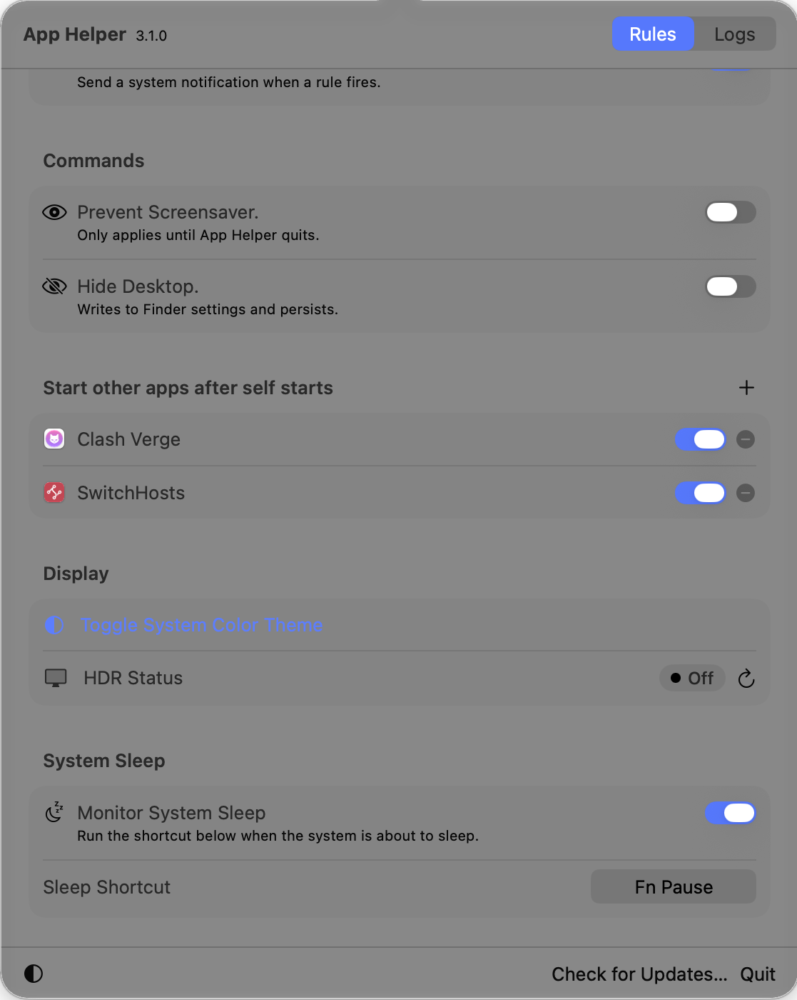

# App Helper
> This app is not sandboxed because it can terminate and relaunch other apps and services.

Project website: https://owenzhao.github.io/App-Helper/





## What It Does

App Helper is a small, open-source macOS utility for the recurring maintenance tasks
that are easy to forget: cleaning up helper processes after an app quits, watching
for problematic developer-tool activity, keeping companion apps available, and
providing a few useful display and sleep controls. It can run quietly from the menu
bar while applying only the rules that you enable.

## Features

- **Rule-based app cleanup.** Listen for app termination events and, after a short
  delay, restart selected helpers or clean up processes left behind by Xcode, Safari,
  and other applications. The built-in rules include SourceKitService, Open and Save
  Panel Service, QuickLookUIService, Web Content, and Safari-related processes.
- **Xcode monitoring.** Watch for sustained high CPU usage by Xcode and record the
  event or send a local notification when it needs attention. App Helper can also
  clean up SourceKitService after Xcode exits.
- **Auto-start companion apps.** Add applications from the Applications folder,
  enable or disable them individually, and let App Helper reopen an enabled app when
  it is no longer running. Duplicate entries are avoided by bundle identifier or
  application path.
- **Display and sleep tools.** Toggle the system color theme, inspect HDR status,
  prevent the display from sleeping, hide or show the desktop, and configure a
  keyboard shortcut for sleep monitoring.
- **Menu bar popover.** Open rules and logs from the menu bar icon, with display
  appearance, update, and quit actions in the same compact panel.
- **Notifications and logs.** Optionally receive a local notification when a rule
  matches. Actions are also recorded in the in-app logs so it is possible to see
  what was started, restarted, terminated, or could not be completed.

App Helper is intentionally focused on local macOS automation. It does not require a
server or an account. Because it manages other applications and system services, the
app is not sandboxed and some actions may require the relevant macOS permissions.

## How to Use
1. Click the App Helper icon in the menu bar to open its popover.
2. Enable the rules you want to apply; App Helper keeps running from the menu bar.
3. Switch to **Logs** to search or clear recorded actions.

That's all. 

## Updates

The direct-download macOS build checks for updates automatically. Users can also
choose **Check for Updates…** from the menu bar icon.

Updates are published through the [Sparkle](https://sparkle-project.org/) appcast
at `https://owenzhao.github.io/App-Helper/appcast.xml`. The app only accepts
updates signed with App Helper's EdDSA key, in addition to normal macOS code
signing validation.

To publish a new direct-download build:

1. Archive, Developer ID sign, and notarize the release build. Increase
   `CURRENT_PROJECT_VERSION` for every update.
2. Create a `.dmg` or `.zip` containing only `App Helper.app`, then use
   Sparkle's `generate_appcast` tool to sign the archive and update
   `website/public/appcast.xml`. Keep the archive filenames in a local release
   directory so Sparkle can retain prior update entries and generate deltas:

   ```sh
   generate_appcast \
     --account com.parussoft.app-helper.sparkle \
     --download-url-prefix "https://github.com/owenzhao/App-Helper/releases/download/发布X.Y.Z/" \
     --link "https://owenzhao.github.io/App-Helper/" \
     /path/to/app-helper-release-archives
   ```

   Copy the generated `appcast.xml` to `website/public/appcast.xml`.
3. Upload every archive and delta file referenced by the generated appcast to
   the matching GitHub Release. Sparkle may point retained-version archives at
   the new release tag, so include those archives too. Commit `appcast.xml` and
   its release notes under `website/public/`; the GitHub Pages workflow
   publishes them.

The matching private EdDSA key is stored only in the login Keychain under the
account `com.parussoft.app-helper.sparkle`; never commit or upload it.

## Suggestions
If you have other rules you want to apply, please file them on Github issues.

## Images
<a href="https://www.flaticon.com/free-icons/lion" title="lion icons">Lion icons created by justicon - Flaticon</a>
<a href="https://www.flaticon.com/free-icons/lion" title="lion icons">Lion icons created by Freepik - Flaticon</a>
